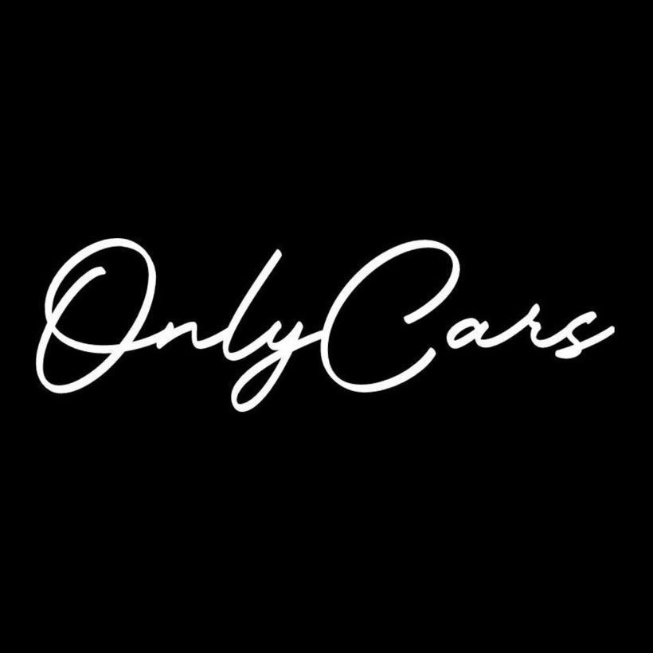

#  OnlyCars

**OnlyCars** adalah platform komunitas otomotif yang memungkinkan penggemar mobil untuk:
- Menemukan dan mengikuti event car meet internasional maupun lokal
- Mengeksplorasi galeri foto mobil keren
- Membeli merchandise eksklusif komunitas

Website ini dibuat menggunakan **Laravel** dan **Tailwind CSS** dengan fokus pada UX modern, animasi halus, dan desain futuristik.

---

## Fitur

- **Event Management:** CRUD event (create, read, update, delete) dengan detail lengkap: title, date, location, description, dan poster/image.
- **Gallery:** Upload dan tampilkan foto mobil keren dari event atau komunitas.
- **Merchandise:** Toko digital untuk menjual merchandise komunitas.
- **Responsive Design:** Tampilan adaptif di desktop, tablet, dan mobile.
- **Interactive Animations:** Background animasi, hover efek, dan transisi smooth untuk pengalaman pengguna yang modern.

---

## Teknologi

- **Backend:** Laravel 10
- **Frontend:** Blade Template + Tailwind CSS
- **Database:** SQLite (dev) / MySQL (prod)
- **File Storage:** Local disk (public folder)

---

## Instalasi
```bash

# 1️⃣ Clone repo
git clone https://github.com/Al11yy/CarsOnly.git
cd onlycars

# 2️⃣ Install dependencies
composer install
npm install

# 3️⃣ Konfigurasi environment
cp .env.example .env
php artisan key:generate

# 4️⃣ Migrasi database
php artisan migrate

# 5️⃣ Jalankan server
php artisan serve
npm run dev
